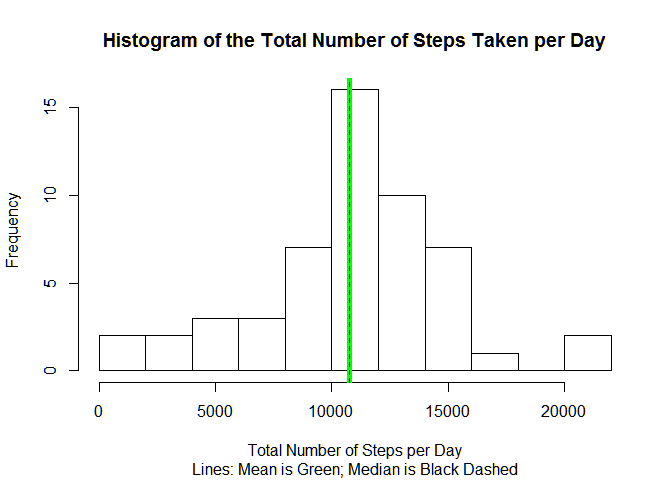
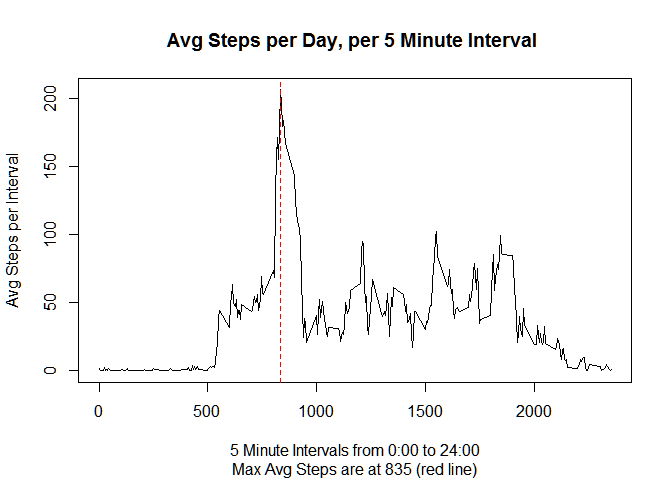
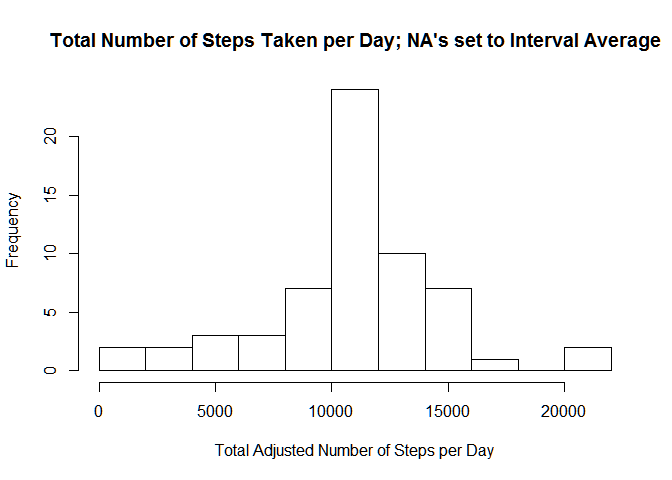
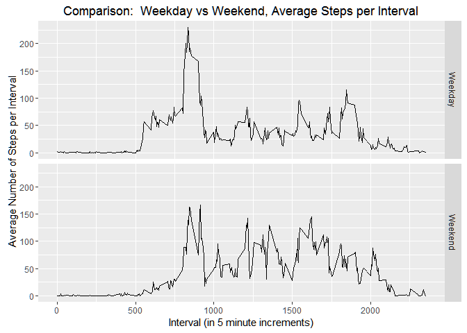

# Reproducible Research: Peer Assessment 1
title: "PA1_template_final2.md"
output: github_document
---


```r
knitr::opts_chunk$set(echo = TRUE)
```

## Loading and preprocessing the data

Several packages were loaded (plyr, dplyr, ggplot2, grid, knitr, lubridate, markdown, rmarkdown, utils and tidyr) however in the interest of tidy output echo has been set to FALSE and results to "hide".


```
## Warning: package 'plyr' was built under R version 3.2.4
```

```
## Warning: package 'dplyr' was built under R version 3.2.4
```

```
## 
## Attaching package: 'dplyr'
```

```
## The following objects are masked from 'package:plyr':
## 
##     arrange, count, desc, failwith, id, mutate, rename, summarise,
##     summarize
```

```
## The following objects are masked from 'package:stats':
## 
##     filter, lag
```

```
## The following objects are masked from 'package:base':
## 
##     intersect, setdiff, setequal, union
```

```
## Warning: package 'ggplot2' was built under R version 3.2.5
```

```
## Warning: package 'lubridate' was built under R version 3.2.4
```

```
## 
## Attaching package: 'lubridate'
```

```
## The following object is masked from 'package:plyr':
## 
##     here
```

```
## The following object is masked from 'package:base':
## 
##     date
```

```
## Warning: package 'markdown' was built under R version 3.2.4
```

```
## Warning: package 'tidyr' was built under R version 3.2.4
```

For this exercise I obtained data ("activity.csv") from the Coursera site. 
The data is available on the rdpeng github site as well.
Site source and fileUrl for the data is:
fileUrl <- "https://d396qusza40orc.cloudfront.net/repdata%2Fdata%2Factivity.zip"


```r
setwd("~/R/Reproducible Research/RepResearchAssignment1")
activity <- read.csv("activity.csv")
dateDownloaded <- now()
activity <- tbl_df(activity)

# convert column "date" to date format; use that to summarize.
activity$date <- as.Date(activity$date)
```

## What is mean total number of steps taken per day?
We can group the data by date, sum the number of steps per day and then calculate daily statistics like the mean and median.  
First sum the number of steps taken each day:


```r
group_by(activity, date) %>% summarize(sumSteps = sum(steps)) -> stepsDay
stepsDay
```

```
## Source: local data frame [61 x 2]
## 
##          date sumSteps
##        (date)    (int)
## 1  2012-10-01       NA
## 2  2012-10-02      126
## 3  2012-10-03    11352
## 4  2012-10-04    12116
## 5  2012-10-05    13294
## 6  2012-10-06    15420
## 7  2012-10-07    11015
## 8  2012-10-08       NA
## 9  2012-10-09    12811
## 10 2012-10-10     9900
## ..        ...      ...
```

```r
steps_per_Day_Mean = mean(stepsDay$sumSteps, na.rm = TRUE)
steps_per_Day_Median = median(stepsDay$sumSteps, na.rm = TRUE)
```

The mean number of steps per day equals 1.0766189\times 10^{4} and the median equals 10765.

The histogram below shows the almost identical mean and median in green and black dashed lines, respectively, along with the dispersion around the mean.


```r
histogram_stepsDay <- hist(stepsDay$sumSteps, breaks = 10, xlab="Total Number of Steps per Day", 
     main="Histogram of the Total Number of Steps Taken per Day",
     sub="Lines: Mean is Green; Median is Black Dashed")
abline(v = steps_per_Day_Mean, col = "green", lwd =5)
abline(v = steps_per_Day_Median, col = "black", lwd = 1, lty = 2)
```

<!-- -->

## What is the average daily activity pattern?

To see the daily activity pattern we can average across all days the number of steps per 5 minute interval.  This information can then be plotted as a time series, producing a visual representation of an average day's stepwork in 5 minute tact.


```r
activity %>% group_by(interval) %>% 
    summarize(intervalAvg=mean(by=steps, na.rm=TRUE)) -> fiveMinAvg 
```

```r
max5MinuteAvgIndex <- which.max(fiveMinAvg$intervalAvg)
maxStepsInterval <- fiveMinAvg$interval[[max5MinuteAvgIndex]]

# Max number of steps in the 5 minute interval starting at:
maxStepsInterval 
```

```
## [1] 835
```

```r
plot_fiveMinAvg <- with(fiveMinAvg, plot(interval, intervalAvg, type="l", 
    ylab="Avg Steps per Interval",
    xlab="5 Minute Intervals from 0:00 to 24:00", 
    main = "Avg Steps per Day, per 5 Minute Interval ", 
    sub="Max Avg Steps are at 835 (red line)"))
    abline(v=maxStepsInterval, col="red", lty = 2)
```

<!-- -->

The time series plot give us a feeling for how activity ebbs and flows during the course of the day.  Not surprisingly, the most active time of the day corresponds to morning rush hour.  Interval 835 corresponding to the 5 minute interval from 8:35 to 8:40 a.m. is when typically the maximum number of steps are taken.

## Imputing missing values


```r
steps_na <- is.na(activity)
sum(steps_na)
```

```
## [1] 2304
```

The original data file contained 2304 missing values.

To impute the missing values we'll take the mean of the respective 5 minute intervals with a value and replace the NA with the mean for that interval.  The result will be a new file, which we'll call "activity_new", without missing values. 


```r
activity_new <- transform(activity, steps=ifelse(is.na(activity$steps), 
        fiveMinAvg$intervalAvg, steps)) %>% 
        select(steps, date, interval) 
```

Here is a histogram of the  tottal number of steps taken each day based on "activity_new".


```r
activity_new %>% group_by(date) %>% summarize(sumSteps_new = sum(steps)) -> stepsDay_new

par(mfrow=c(1,1))
histogram_stepsDay_new <- hist(stepsDay_new$sumSteps_new, breaks = 10, xlab="Total Adjusted Number of Steps per Day", 
     main="Total Number of Steps Taken per Day; NA's set to Interval Average")
```

<!-- -->

Now let's look at the summary statistics and whether anything has changed.


```r
summary_StepsPerDay_original <- summary(stepsDay)
print(summary_StepsPerDay_original, type="html")
```

```
##       date               sumSteps    
##  Min.   :2012-10-01   Min.   :   41  
##  1st Qu.:2012-10-16   1st Qu.: 8841  
##  Median :2012-10-31   Median :10765  
##  Mean   :2012-10-31   Mean   :10766  
##  3rd Qu.:2012-11-15   3rd Qu.:13294  
##  Max.   :2012-11-30   Max.   :21194  
##                       NA's   :8
```

```r
summary_StepsPerDay_new <- summary(stepsDay_new)
print(summary_StepsPerDay_new, type="html")
```

```
##       date             sumSteps_new  
##  Min.   :2012-10-01   Min.   :   41  
##  1st Qu.:2012-10-16   1st Qu.: 9819  
##  Median :2012-10-31   Median :10766  
##  Mean   :2012-10-31   Mean   :10766  
##  3rd Qu.:2012-11-15   3rd Qu.:12811  
##  Max.   :2012-11-30   Max.   :21194
```

Looking at the summaries for both the original and the "new" activity data, we can see that mean and median are unchanged.  
Note, however, the change in 1st and 3rd quartiles and the effect that imputing missing values has had.
If we examine both histograms side by side, another effect also becomes apparent.


```r
par(mfrow=c(1,2))
histogram_stepsDay2 <- hist(stepsDay$sumSteps, breaks = 10, xlab="Total Number of Steps per Day",      main="Total Steps/Day, with NA's",
     sub="Lines:  Mean=Green;  Median=Black Dashed",
     ylim=c(0,25))

histogram_stepsDay_new2 <- hist(stepsDay_new$sumSteps_new, breaks = 10, xlab="Total Adj. Number of Steps per Day", 
     main="Total Steps/Day, NA's = Interval Avg",
     sub="1st & 3rd Qu.: Green = NA's, Red = Imputed",
     ylim=c(0,25))
     abline(v = c(9819,12811),  col = "red")
     abline(v = c(8841, 13294), col = "green")
```

<!-- -->

As a result of imputing average values for missing values, there has been a subtle shift in the distribution, as if it has become a touch leptokurtic. 

In the "new" histogram the 1st and 3rd quartiles have moved closer to the mean, as shown by the shift in lines (green to red; green = 1st & 3rd Quaritles from origninal data and red is 1st and 3rd Quartiles with NA's imputed to average values for the interval).  

We see that the mean and median are unchanged, however the "new", imputed data demonstrates a stronger central tendency as can be noted by the substantially higher frequency of 'mean' days.

## Are there differences in activity patterns between weekdays and weekends?

Using the "new" dataset, with imputed values, let's examine this question. 
We'll first create a column indicting whether the data comes from a "Weekeday" or "Weekend".


```r
activity_new$day <- factor(weekdays(activity_new$date), 
    levels = c("Monday", "Tuesday", "Wednesday", "Thursday", "Friday", "Saturday", "Sunday"),
    labels = c("Weekday", "Weekday", "Weekday", "Weekday", "Weekday", "Weekend", "Weekend"))
```

```
## Warning in `levels<-`(`*tmp*`, value = if (nl == nL) as.character(labels)
## else paste0(labels, : duplicated levels in factors are deprecated
```

Next we'll filter the data by Weekday and Weekend, and take means for each 5 minute interval for both sets of days.


```r
wkendAvg <- activity_new %>% filter(day == "Weekend") %>% group_by(interval) %>% 
    summarize(Avg=mean(by=steps))

wkdayAvg <- activity_new %>% filter(day == "Weekday") %>% group_by(interval) %>% 
    summarize(Avg=mean(by=steps))
```

Now we can plot these interval averages and compare.


```r
wkendAvg$dayType <- c("Weekend")
wkdayAvg$dayType <- c("Weekday")

dayTypeAvg <- bind_rows(wkendAvg, wkdayAvg)
dayTypeAvg$dayType <- as.factor(dayTypeAvg$dayType)

ggdayType <- ggplot(dayTypeAvg, aes(x=interval, y=Avg)) +geom_line() +facet_grid(dayType~.)
ggdayType +labs(x="Interval (in 5 minute increments)", 
      y="Average Number of Steps per Interval", 
      title="Comparison:  Weekday vs Weekend, Average Steps per Interval")
```

<!-- -->

Not surprisingly, on weekends we see a slightly later start to the day (weekends are for sleeping in!), a greater and somewhat less regular pattern of activity  on throughout the day, and a later finish to the day.


